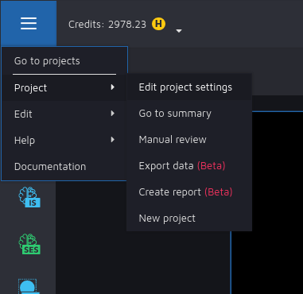
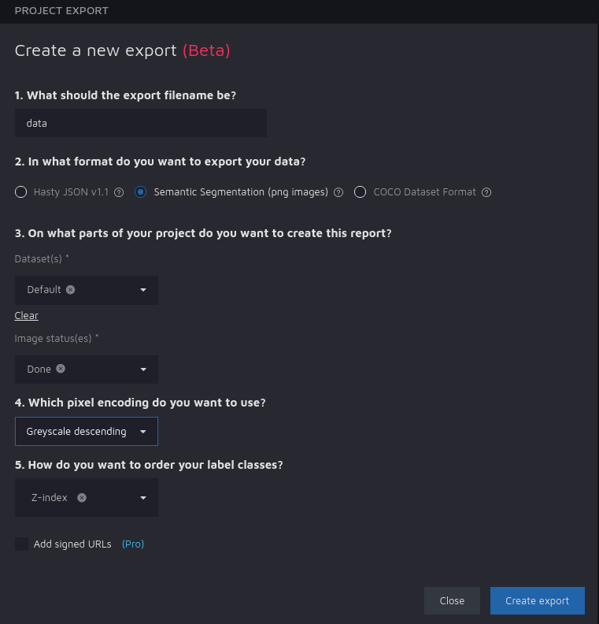
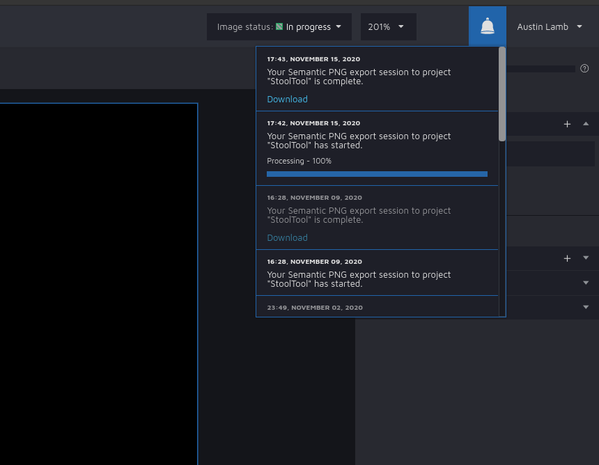

# StoolTool

Predict Bristol consistency of pediatric stool from a picture taken by a parent

# Environment Setup

## Install using pip
### Create venv
To create the virtual environment directory for StoolTool, run `python -m venv <name of virtual environment>`.
 - Running `python -m venv venv` will make a virtual environment that will not be tracked by the `.gitignore`.

### Install required packagess
```
pip install -r requirements.txt
```

## Install using conda
To install the environment using `conda`, follow the instructions from [Anaconda](https://docs.anaconda.com/anaconda/install/) for your operating system.
After installing Anaconda, you may need to install some packages using `conda install -c conda-forge <package>`.

# Run

## Transform Images
```
python3 transform_images.py [Images Directory] [-o <Output Directory>] [-c] [-g] [-u]
```

### Options

-o <Output Directory>
Specify an output directory at the location <Output Directory>. If not specified, defaults to `output/`.

-c
Crops the images in [Images Directory].

-g
Turns images in [Images Directory] into greyscale.

-u
Applies unique UUIDs to images in [Images Directory].

If no options are specified, the program will run all options using images from [Images Directory].

## Susan to Validation Scipt
Transforms Susan's validation directory to our data format.
```
python susan_to_validation.py [Susan Directory] Optional: [Output Directory]
```

## Run Classifier
```
python3 train.py [Config File]
```

- To run using our setting, use `config.yaml`.


### Config File
```
training_data_dir: Path to directory containing images to train on. Must have subdirectories for each class of image (1-7) and "weird" images
validation-data_dir: Path to directory containing validataion data (if separate). Must have subdirectories for each class of image (1-7) and "weird" images.
use_validation_dir: Boolean to use separate validation data form validation directory
downsample_train_data: Boolean for downsampling on the training data due to unbalanced data set
results_dir: Directory containing output performance metrics
train_fraction: Percentage of images from images_dir used as validation (if use_validation_dir is False)
seed: Random seed for shuffling images
learning_rate: Learning rate for classifier
num_epochs: Number of epochs to run
batches_per_epoch: Batches per epoc
batch_size: Batch size

Sample config file formatting in config.yaml
```


### Output
Metrics files are in directory specified by output_dir in config.yaml. Directories in ouput are:
- confusion_matrices
- metrics
- roc_curves
- signed_diff_hists
To see more details on output, watch metrics_info.mkv in the `documentation_media` directory.

### Training Data and Validation Data Directories
Training data is stored as "TrainingData" on the StoolTool shared Google Drive.
Validation Data is stored as "validation" on the StoolTool shared Google Drive.

# Data
## Online Images
Images of stool were gathered using Google reverse image search. This technique yielded many duplicate and near duplicate images and noisy images (e.g. orange curries).
Using [imgdupes](https://github.com/knjcode/imgdupes) we were able to reduce the number of images from 9242 (with duplicates and noise) to 280.

# Flask API Usage 
1. Set directory paths in `app.py` for saving images and desired model and make sure they exist.
2. In `app.py`, edit "HOST" variable to be either localhost (127.0.0.1) or any network IP.
3. Run the Flask application with : `python app.py`.

### Web Usage

1. Navigate to "http://127.0.0.1:5000/get_rating_web" in any web browser.
2. Choose an .jpg or .jpeg file to upload from your computer.
3. Select a predicted label.
4. Press the "Upload" Button.

Demo Video:
`documentation_media/StoolToolFlaskWebDemo`

### JSON usage
To obtain the probabilities values for each label when given file name of image in the specified upload directory and the index of the model that is to be used:
"http://127.0.0.1:5000/get_rating_json/<file_name>&<model_index>".

# Downloading truth masks from hasty.ai
1. Go to hasty.ai and click on the StoolTool project.
2. Select the button with three lines at the top left corner of the screen. Then select project and export data.

    
   
3. Select options according to the above image.

    
4. When clicking the top right bell icon, you should see the status of the exported data and a link to download it once its completed.
    